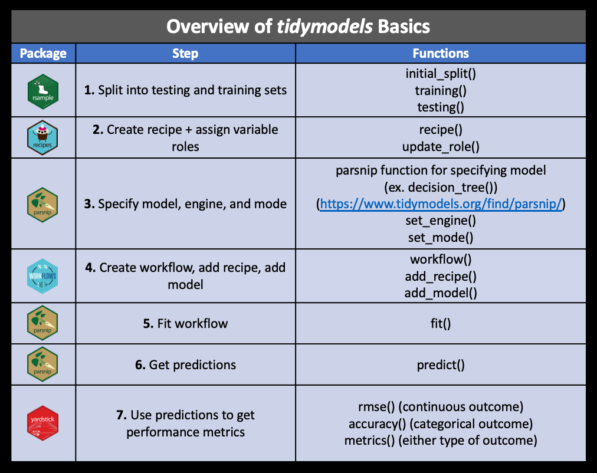

```{r setup, include=FALSE}
knitr::opts_chunk$set(echo = TRUE,warning = F,message = F)
```

# **Welcome Back Everyone!**

**The goal of today is recap what we learned on Tuesday and further our understanding of Tidymodels**

Again, there is a lot of possible information that can be provided on this topic and this workshop isn't meant to exhaust those resources. If you have questions throughout the workshop you can type them in the chat or I will be happy to meet with you afterwords. If you would like some help using Tidymodels for your own data, we do free [consults](https://services.northwestern.edu/TDClient/30/Portal/Requests/ServiceDet?ID=93) for all of your data science needs!

## **Agenda for today**

-   Recap of what we went over last Tuesday

-   Set up a simple Classification model

    -   Prep data
    -   Create recipe
    -   "Bake"
    -   Fitting test data
    -   Assessing fit

-   Try Other types of Classification Models

    -   Experiment with different tuning parameters
    -   Talk about tuning grids
    -   Talk about different forms of resampling

## **Review**

The `tidymodels` framework is a collection of packages for modeling and machine learning using tidyverse principles.


### **We are Focused on Predictive Models**

Whereas **inferential models** help researchers understand the relationship between a set of predictors and an outcome, **predictive models** focus more on optimizing the predictive accuracy of the model.

### **Today We are Building Supervised Classification Models**

**Supervised models** are those that have an outcome variable. Linear regression, decision trees, and numerous other methodologies fall into this category.

Last week, we built **regression** models, which predicts numeric outcome.

This week, we focus on **classification**, which predicts an outcome that is an *ordered* or *unordered* set of qualitative values. A mode of transportation (car, airplane, boat, etc) would be this type of outcome.

### **Reminder of Basic Tidymodels Process**

1.  **Split the data** into `testing` and `training` set. We can either randomly split from the entire dataset or **stratify** based on some variable and then split.
2.  **Define a process for preparing a dataset** by defining a `recipe`. This can be used for modeling or stand-alone preprocessing.
3.  **Choose and define the model** you would like to use.
4.  **Combine your model and recipe** into one `workflow`.
5.  **Fit workflow** with your training data.
6.  Use the trained workflow to **predict the unseen test data**.
7.  **Evaluate performance** of the model with performance metrics.



## **Load Packages and Set Seed**

Following code installs any packages for this workshop that doesn't exist in your system and then load them.

```{r,warning=FALSE,message=FALSE}

# install any packages that doesn't exist in the system
workshop_pkgs <- c(
  "tidymodels", "tidyverse", "janitor", "skimr", "vip", 
  "yardstick", "ranger", "glmnet", "mlbench", "nnet",
  "gridExtra"
)
missing_pkgs <- workshop_pkgs[!(workshop_pkgs %in% installed.packages()[,"Package"])]
if (length(missing_pkgs) != 0) {
  install.packages(missing_pkgs)
}

# Load packages here!
library(tidymodels)
library(tidyverse)
library(janitor)
library(skimr)
library(vip)
library(yardstick)
library(ranger)
library(glmnet)
library(mlbench)
library(nnet)
library(gridExtra)

# Set seed here!
set.seed(1192)
```

# **Classification Model**

For our classification model, where our outcomes are qualititative, we will use the titanic data. Our goal is to predict which passengers would survive the [Titanic shipwreck](https://en.wikipedia.org/wiki/Titanic).

Let's Load the data from `data/titanic.csv` into *R* and familiarize ourselves with the variables it contains using the codebook (`data/titanic_codebook.txt`).

```{r}
# read titanic data and clean the column names
titanic <- read_csv(file="data/titanic.csv") %>%
  clean_names()
print(head(titanic))
```

According to the codebook, we can see that `survival`, `pclass`, and `sex` are variables we would like to include in the model that are categorical.

We want to convert them to `factor` data type. Benefit of doing this is that R will know which variable is categorical vs numeric and we can explicitly choose which category serves as baseline. We want to reorder the factor so that `"Yes"` is baseline for \` and `"female"` is baseline for `sex` - just specify that category first when defining levels.

```{r}
# convert categorical to factor
titanic <- titanic %>%
  mutate(
    pclass = factor(pclass),
    survived = factor(survived,levels=c("Yes","No")),
    sex = factor(sex, levels = c("female", "male"))
  )
```

## **Look at the Distribution of our Outcome Variable**

Using the full data set, explore/describe the distribution of the outcome variable `survived`.

Perform a skim of the training data and note any potential issues such as missingness.

```{r}

ggplot(titanic,aes(survived)) +
  geom_bar() +
  theme_minimal() + 
  ggtitle("Distribution of Survival Outcomes")

skim_without_charts(titanic)

```

`cabin` and `embarked` variables have some missing values, but we won't be using those variables so we're don't have to be worried about that. Do note that there are 177 observations with missing `age` variable. We will come back to this later and try to fill in these values by using imputation methods.

## **Split our data**

Let's use **stratified sampling**. Stratified sample splits the data within the stratification variable. Last week, we stratified based on age, which stratified the data set based on quartiles because age is a numeric variable. This time, we stratify based on survival, which is a categorical variable.

Why is it a good idea to use stratified sampling for this kind of data? This ensures that the distribution of survival outcome remains same between the training and testing data set. This is particularly useful if a certain category is underrepresented in the data set.

We should also choose the proportions to split the data into. Let's verify that the training and testing data sets have the appropriate number of observations.

```{r}
titanic_split <- initial_split(titanic,prop = .70, strata = survived)

titanic_split

titanic_test <- testing(titanic_split)

titanic_train <- training(titanic_split)
```

```{r}
g1 <- ggplot(titanic_train, aes(survived)) +
  geom_bar() +
  theme_minimal() +
  ggtitle("Survival Distribution in\nTraining Set")
g2 <- ggplot(titanic_test, aes(survived)) +
  geom_bar() +
  theme_minimal() +
  ggtitle("Survival Distribution in\nTesting Set")
gridExtra::grid.arrange(g1, g2, nrow = 1)
```

## Exercise 1: Try different splits and stratification!

Adjust the `prop=` argument and try different stratification variable for sampling. You can check the new distribution of `survived` by running the second chunk.

How would this impact your model?

Make sure to remove `eval=FALSE`

```{r,eval=FALSE}
titanic_split_2 <- initial_split(titanic, prop = , strata = )

titanic_split_2

titanic_test_2 <- testing(titanic_split_2)

titanic_train_2 <- training(titanic_split_2)
```

```{r,eval=FALSE}
g1 <- ggplot(titanic_train_2, aes(survived)) +
  geom_bar() +
  theme_minimal() +
  ggtitle("Survival Distribution in\nTraining Set")
g2 <- ggplot(titanic_test_2, aes(survived)) +
  geom_bar() +
  theme_minimal() +
  ggtitle("Survival Distribution in\nTesting Set")
gridExtra::grid.arrange(g1, g2, nrow = 1)

```

## **Which Models can be used with Classification Data?**

Remember "engine" in `tidymodels` defines which package or system is used to fit the model type. We can use `show_engines` to check which engines are available for a model type and what they can be used for.

```{r}
show_engines("rand_forest")
show_engines("logistic_reg")
```

## **Logistic regression recipe**

Let's define how the data should be preprocessed.

Using the training data, create and store a recipe setting `survived` as the outcome and using the following predictors. To learn more about recipes, you can check out our last week's workshop.

-   `pclass`: ticket class
-   `sex`
-   `age`
-   `sib_sp`: number of siblings or spouses aboard
-   `parch`: number of parents or children aboard
-   `fare`: passenger fare

Recall that there were missing values for `age`. To deal with this, add an imputation step using `step_impute_linear()`.

```{r}
logistic_recipe <- recipe(
  survived~pclass+sex+age+sib_sp+parch+fare,
  data = titanic_train) %>%
  step_impute_linear(age)
logistic_recipe
```

Next, use `step_dummy()` to **dummy** encode categorical predictors of class and sex.

```{r}
logistic_recipe <- logistic_recipe %>%
  step_dummy(pclass, sex)
logistic_recipe
```

How would you add an interaction with age and fare as well as sex and fare using `step_interact` and standardize using `step_normalize`?

```{r}
logistic_recipe <- logistic_recipe %>%
  step_interact(~ age:fare + starts_with("sex"):fare) %>%
  step_normalize(all_predictors())
logistic_recipe
```

**NOTE**: Why is it `starts_with("sex")`? This is what's in the documentation for `terms=` argument:

> consider using `tidyselect::starts_with()` when dummy variables have been created.

When dummy variables are created, new columns are created as `<variable_name>_<category>` and the original variable is deleted. Therefore, specifying interaction with the original variable name may not work.

## **Exercise 2: Define recipe at once**

I have added and illustrated each step in the recipe, but you can define all the steps at once by combining all the code. Try doing that yourself!

As a quick review, steps we defined are:

-   set model formula using `titanic_train` data

-   impute age by linear regression model

-   one-hot dummy code `pclass`, `sex`

-   add interaction between age vs fare and sex vs fare

-   normalize all predictors

```{r}

```

## **Bake Both Recipes**

Let's also create a recipe for a random forest model. For this model, I will use something called **one-hot encoding** when dummy coding.

```{r}
random_forest_recipe <- recipe(
  survived~pclass+sex+age+sib_sp+parch+fare,
  data = titanic_train) %>%
  step_impute_linear(age) %>%
  step_dummy(pclass,sex,one_hot = TRUE) %>%
  step_interact(~age:fare + starts_with("sex"):fare) %>%
  step_normalize(all_predictors())
```

How does one hot change your variables?

```{r}
logistic_recipe %>%
  prep() %>%
  bake(new_data=NULL) %>%
  select(starts_with("pclass"), starts_with("sex")) %>%
  head

random_forest_recipe %>%
  prep() %>%
  bake(new_data=NULL) %>%
  select(starts_with("pclass"), starts_with("sex")) %>%
  head
```

## **Fit your Logistic Model**

Now that we have the recipe for logistic regression model, we should initialize the logistic model for fitting. Logistic regression is usually done with the `glm` function. The appropriate engine to set for that is `"glm"`.

As we've seen before, some models can be used for both classification and regression. It's good practice to be explicit about which type of problem we are tackling, which in our case is classification.

```{r}
logistic_model <- logistic_reg() %>%
  set_engine("glm") %>%
  set_mode("classification")
logistic_model
```

After model definition, we create a workflow that combines the recipe and the model.

```{r}
logistic_workflow <- workflow() %>%
  add_model(logistic_model) %>%
  add_recipe(logistic_recipe)
logistic_workflow
```

The only thing left to do is fit the model!

```{r}
logistic_fit <- logistic_workflow %>%
  fit(data=titanic_train)

tidy(logistic_fit)
```

## Fit a Random Forest With no Hyperparameters

Let's do the same thing for random forest model. We'll fit two random forest models: one with a default set of hyperparameters and another one with custom hyperparameters. **Hyperparameters** are a set of parameters that define the model learning process.

-   `mtry`: number of predictors that is randomly samples for each split
-   `trees`: number of trees in a random forest model
-   `min_n`: minimum number of data points in a node that are required for it to be split further

```{r}
# initialize the model
random_forest_model<-rand_forest()%>%
  set_engine("ranger")%>%
  set_mode("classification")

# combine recipe with the model into one workflow
random_forest_workflow<-workflow()%>%
  add_model(random_forest_model)%>%
  add_recipe(random_forest_recipe)

# fit the final workflow
random_forest_fit<-random_forest_workflow%>%
  fit(data=titanic_train)
```

## **Fit a Second Random Forest with Hyper-parameters**

```{r}
# initialize the model
random_forest_model_2<-rand_forest(mtry = 8,trees =1000,min_n = 4)%>%
  set_engine("ranger")%>%
  set_mode("classification")

# combine recipe with the model into one workflow
random_forest_workflow_2<-workflow()%>%
  add_model(random_forest_model_2)%>%
  add_recipe(random_forest_recipe)

# fit the final workflow
random_forest_fit_2<-random_forest_workflow_2%>%
  fit(data=titanic_train)
```

# **Which Model did Best?**

We'd like to know which model performs best on predicting survival outcome based on passenger information. To do this, we predict survival and evaluate performance using the testing dataset.

There are many different types of metrics available for evaluating classification. For this data, we will use accuracy, which is simply the proportion of the data that are predicted correctly. Other potential metrics are: Precision, Recall, and F1 Score.

```{r}
model_assessment1 <- logistic_fit %>%
  # make prediction on test data
  predict(new_data=titanic_test) %>%
  # bind prediction and the "true survival outcome" together
  bind_cols(titanic_test %>%
              select(survived)) %>%
  # calculate accuracy
  accuracy(truth=survived,estimate=.pred_class) %>%
  # add model name
  mutate(model="Logistic Regression")

model_assessment2<-random_forest_fit %>%
  predict(new_data=titanic_test) %>%
  bind_cols(titanic_test %>%
              select(survived)) %>%
  accuracy(truth=survived,estimate=.pred_class) %>%
  mutate(model="Random Forrest 1")

model_assessment3<-random_forest_fit_2 %>%
  predict(new_data=titanic_test) %>%
  bind_cols(titanic_test %>%
              select(survived)) %>%
  accuracy(truth=survived,estimate=.pred_class) %>%
  mutate(model="Random Forrest 2")

model_assessment <- bind_rows(
  model_assessment1,
  model_assessment2,
  model_assessment3
)

print(model_assessment)
```

## Exercise 3: Other metrics

As I mentioned, there are other metrics available. Try using `precision()` and `recall()` in place of `accuracy()` and see if the same results hold!

```{r}

```

What are precision and recall? Here are the formulas for precision and recall:

$Precision = \frac{\# TruePositive}{\#TruePositive + \#FalsePositive}$

$Recall = \frac{\#TruePositive}{\#TruePositive+\#FalseNegative}$

These measures condition on different aspects of the data and the model output. In words, precision measures the proportion of "Positives" as predicted by the model to be actually positive, while recall measures the proportion of real positive cases identified as positive.

What would be the Recall if we have a model that labels everything as positive?

# **Model tuning via grid search**

We would like to identify a set of hyperparameters that will give the best prediction.

But there are so many combinations of hyperparameters to choose from and it can be burdensome to create a workflow for each combination. This is where **grid search** comes into place. Grid search facilitates the process of computing performance metrics for a pre-defined set of hyperparameters. Let's that with a random forest model!

First, in the model definition step, instead of specifying a hyperparameter with a specific value, we will pass `tune()`, which serves as a placeholder and lets the model know that we plan on tuning this parameter.

```{r}
random_forest_model_tune <- rand_forest(
  mtry = tune(), # tune this
  trees = 1000,
  min_n = tune() # and this
) %>%
  set_mode("classification") %>% 
  set_engine("ranger", importance = "impurity")

# 
random_forest_workflow_tune <- workflow() %>%
  add_model(random_forest_model_tune) %>%
  add_recipe(random_forest_recipe)

random_forest_fit_tune <- random_forest_workflow_tune%>%
  fit(data=titanic_train)
```

After we set our models we have to get ready for our search

Here we:

Do a resampling of our data - for this we are doing Cross Validation.

Set the metric that we want to use.

Set a grid of values to try for each hyperparameter.

We are also set our grid control to save the predictions we are making.

In this case we are not setting a grid so the hyper parameters that we are tuning will be random within the possible range.

```{r}
titanic_rs <- bootstraps(titanic_train, times = 5)


roc_vals <- metric_set(roc_auc)


ctrl <- control_grid(verbose = FALSE, save_pred = TRUE)


```

This code tests your models on the grid based on the amount of resampling and hyperparemeters you set.

**Warning these can take a while to run so I would start small to make sure it doesn't break**

```{r,}


formula_res <-
  tune_grid(random_forest_model_tune,
    random_forest_recipe,
    resamples = titanic_rs,
    metrics = roc_vals,
    control = ctrl
  )


formula_res
```

Here we can see the accuracy for each individual model within one of our bootstraps out of the five total

Within each of the 5 bootstraps it defaults to ten models (we can change that later when we set out grid)

```{r}

formula_res %>% 
  select(.metrics) %>% 
  slice(1) %>% 
  pull(1)


```

This collects the accuracy of the models across our bootstraps

You can see that each of the ten models within each bootstrap uses the same hyperparameters

```{r}

estimates <- collect_metrics(formula_res)
estimates

```

This shows us the best models in that we made and gives us an idea of the types of hyperparameters that we might want to be using

```{r}
show_best(formula_res, metric = "roc_auc")
```

This shows us how our models would predict our data

```{r}
collect_predictions(formula_res)%>%
  head()
```

This shows the accuracy of the different hyperparameters tuning

```{r}

autoplot(formula_res, metric = "roc_auc")

```

A graphic representation of our average predictions across the variable age

```{r}

augment(formula_res) %>%
  ggplot(aes(age, .pred_Yes, color = survived)) +
  geom_point() +
  facet_wrap(~survived)+
  theme_minimal()

```

Now try running a random forest with the suggested hyperparameters

```{r}

random_forest_model_refined<-rand_forest(mtry = 2,trees =1000,min_n = 30)%>%
  set_engine("ranger", importance = "impurity")%>%
  set_mode("classification")


random_forest_workflow_refined<-workflow()%>%
  add_model(random_forest_model_refined)%>%
  add_recipe(random_forest_recipe)


random_forest_fit_refined<-random_forest_workflow_refined%>%
  fit(data=titanic_train)


```

```{r}


fit<-extract_fit_engine(random_forest_fit_refined)

vip(fit)

```

```{r}

model_assesment4<-random_forest_fit_refined%>%
  predict(new_data=titanic_test)%>%
  bind_cols(titanic_test%>%
              select(survived))%>%
  accuracy(truth=survived,estimate=.pred_class)%>%
  mutate(model="Random Forrest refined bootstrap")%>%
  bind_rows(model_assesment3)

model_assesment4%>%
  arrange(-.estimate)

```

# **Now lets try to do resampling through cross validation!**

This time lets tune all three of our hyperparameters

```{r}

model_cv <- 
  rand_forest(mtry = tune(), trees = tune(), min_n = tune()) %>% 
  set_engine("ranger", importance = "impurity") %>% 
  set_mode("classification")

```

This time lets set a regular tuning grid

```{r}


grid_rf<- grid_random(
  mtry() %>% range_set(c( 1,  12)),
  trees() %>% range_set(c( 500, 2000)), 
  min_n() %>% range_set(c(2,  10)),
  size = 10)


grid_rf


```

Here we create a new workflow for the model we just made

```{r}

wkfl_cv <- 
  workflow() %>% 
  add_recipe(random_forest_recipe) %>% 
  add_model(model_cv)


```

Here we create the folds - Here we create five

-   


```{r}

cv_folds <- vfold_cv(titanic_train, v = 5)
cv_folds

```

Here we use what we made to run the different models on our folds

**Again be careful here because this can take some time so start small to make sure it doesn't break**

```{r}

rf_fit <- tune_grid(
  wkfl_cv,
  resamples = cv_folds,
  grid = grid_rf,
  metrics = roc_vals,
  control = ctrl 
)


```

```{r}
collect_metrics(rf_fit)
```

```{r}
autoplot(rf_fit, metric = "roc_auc")
```

```{r}
show_best(rf_fit, metric = "roc_auc", maximize = TRUE)
```

```{r}
select_best(rf_fit, metric = "roc_auc", maximize = TRUE)


```

```{r}
tuned_model <-
  wkfl_cv %>% 
  finalize_workflow(select_best(rf_fit, metric = "roc_auc", maximize = TRUE)) %>% 
  fit(data = titanic_train)
```

```{r}
model_assesment5<-tuned_model%>%
  predict(new_data=titanic_test)%>%
  bind_cols(titanic_test%>%
              select(survived))%>%
  accuracy(truth=survived,estimate=.pred_class)%>%
  mutate(model="Random Forrest refined cross validation")%>%
  bind_rows(model_assesment4)

model_assesment5%>%
  arrange(-.estimate)
```

Thank you all for coming this week and feel free to stay around or email me if you have any questions!
